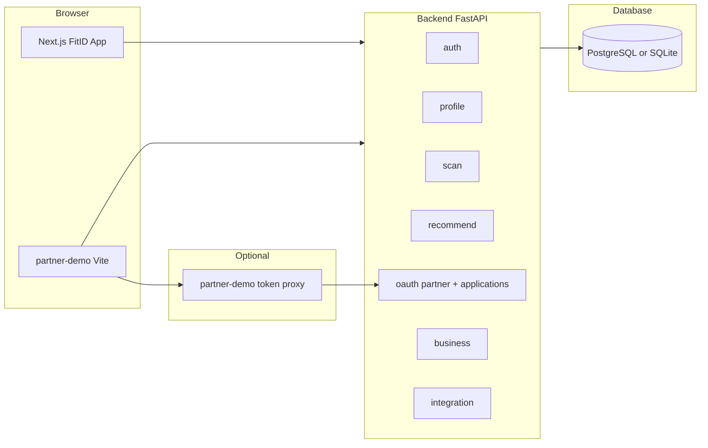

# FitID — Complete Business & Technical Brief

**Audience:** Board members, investors, commercial partners, and technical due-diligence teams who need to understand the product end-to-end and speak about it confidently.

**Companion docs:** [`README.md`](../README.md) (setup), [`PROJECT_STRUCTURE.md`](./PROJECT_STRUCTURE.md) (architecture detail), [`FITID_MASTER_BUILD_PROMPT.md`](./FITID_MASTER_BUILD_PROMPT.md) (original build specification).

---

## 1. Purpose of this document

This file is the **single narrative** for FitID: what problem it solves, who it serves, what the shipped software does today, how it is built, how to demonstrate it, and what comes next. Use it as a **read-through before a pitch** and as a **handout** for anyone who must explain the project without reading the codebase.

---

## 2. Elevator pitch

**FitID is a universal digital fit identity.** Shoppers build one rich profile (measurements, posture, sensitivities, fit preferences, and optional scan-derived signals). That profile powers **personalized sizing and product ranking** inside FitID, and—through **“Sign in with FitID”**—can be shared with retailers under explicit consent, so partners receive a **scoped partner access token** and optional profile slices instead of rebuilding fit data on every site.

---

## 3. The problem

- **Fragmented fit data:** Every store asks for size charts, returns are costly, and confidence is low.
- **Repeated friction:** Users re-enter measurements, preferences, and sensitivities on each new channel.
- **Partner limitation:** Retailers want personalization but lack a **trusted, consent-based** way to access standardized body and preference data.

---

## 4. The solution (product definition)

FitID combines:

1. **Identity & account** — Google sign-in (production path) and username/password (demo-friendly path), with role support for **shopper** vs **business**.
2. **Fit profile** — Structured JSON fields for body measurements, posture, skin tone, allergies, sensitivities, fit preferences, and confidence scoring from scans.
3. **Capture & refinement** — Quick scan payloads and optional **live scan** uploads (front/side imagery plus height/weight) processed server-side into profile updates.
4. **Intelligence** — Rule-based **recommendation and personalization** services that rank catalog items against the full profile.
5. **Experience layer** — Next.js app with guided **journey**, **dashboard**, **Fashion Hub**, **3D avatar**, **virtual try-on** experiences, and **PWA** affordances.
6. **Partner ecosystem** — OAuth2-style **partner authorization**, consent UI on the FitID domain, token exchange, optional **standalone partner demo storefront** for live demos.

---

## 5. Who the product serves

| Segment | What they get in this codebase |
|--------|----------------------------------|
| **Shoppers** | Sign-in, onboarding journey, scan, profile, recommendations, fashion browsing, avatar and try-on surfaces, dashboard. |
| **Business operators** | `/business` insights (demo snapshot unless authenticated as `account_type=business`). |
| **Retail / tech partners (concept)** | OAuth client registration (business accounts), `GET /oauth/authorize`, consent, `POST /oauth/token`, integration consent APIs; **partner-demo** mini-store for pitches. |

---

## 6. Product tour — what exists in the app (routes)

All paths are relative to the main Next.js app (default **http://localhost:3000**).

| Route | Purpose |
|-------|---------|
| `/` | Landing: sign-in with Google (NextAuth) and/or **username/password**; entry to the product. |
| `/register` | Create a FitID account with password (optional shopper/business at registration). |
| `/sign-in` | Dedicated sign-in entry if used in your deployment. |
| `/auth/success` | After Google OAuth: exchanges Google **ID token** for FitID **session JWT** via backend, persists session, routes to dashboard or business. |
| `/auth/error` | Auth failure handling. |
| `/journey` | **Guided multi-step journey** through the core FitID stages (profile, scan, preferences, consent, recommendations—wired to backend APIs). |
| `/dashboard` | Shopper hub: profile summary, recommendations, navigation to other features. |
| `/scan` | Body scan experience (quick and/or live flows depending on UI wiring). |
| `/fashion-hub` | Catalog-oriented experience with personalized product surfacing. |
| `/avatar` | **3D body avatar** visualization (Three.js / React Three Fiber pipeline; uses profile-driven mesh and styling where configured). |
| `/try-on` | **Virtual try-on** experience layering garments on the avatar representation. |
| `/business` | Business dashboard and analytics-style content (API-backed for live business users). |
| `/partner/console` | **OAuth application console** for business accounts (register `client_id`, secrets, redirect URIs). |
| `/partner/demo` | In-app **simulated retailer** with “Sign in with FitID” linking to backend authorize URL. |
| `/partner/demo/callback` | OAuth redirect handler: exchanges `code` via Next.js API route for token display (demo). |
| `/partner/oauth/consent` | User consent screen when arriving from `GET /api/v1/oauth/authorize` with a `login_token`. |

**Standalone partner pitch app:** `partner-demo/` (Vite, default **http://localhost:5174**) — professional mini-store UI; **Fit ID** control opens a panel for OAuth and token paste; uses a small **local token proxy** so `client_secret` never ships in the browser.

---

## 7. User journeys (story form)

### 7.1 New shopper (happy path)

1. Lands on `/`, signs in with **Google** or **password**.
2. Google path: NextAuth → `/auth/success` → `POST /api/v1/auth/google` with verified ID token → receives **FitID JWT** (subject = email) → stored client-side (`localStorage` / session helpers).
3. Completes `/journey` stages: measurements and preferences converge on the **FitProfile** row in the database.
4. Uses `/scan` (quick or live) so the backend **updates** `body_measurements`, posture-related fields, and `confidence_score` as implemented.
5. Opens `/dashboard` or `/fashion-hub` and sees **personalized ranking** from `GET /api/v1/recommend/personalized/{email}` (and related client calls).

### 7.2 Business operator

1. Registers or is assigned `account_type=business` (per product rules).
2. Uses `/business` for insights; uses `/partner/console` to register OAuth clients for real partner integrations.

### 7.3 Partner “Sign in with FitID” (technical happy path)

1. Partner site sends the user to **`GET /api/v1/oauth/authorize`** with `client_id`, `redirect_uri`, `state`, `scope`.
2. Backend validates client and redirect URI, stores a **pending login**, redirects browser to FitID **`/partner/oauth/consent?login_token=...`** (base URL from `FITID_PUBLIC_URL`).
3. Authenticated FitID user approves; frontend calls **`POST /api/v1/oauth/approve`** with Bearer **consumer** JWT; backend issues **authorization `code`**, returns partner `redirect_url` with `code` and `state`.
4. Partner backend calls **`POST /api/v1/oauth/token`** with `grant_type=authorization_code`, `code`, `client_id`, `client_secret`, `redirect_uri`.
5. Backend returns **`access_token`** (partner JWT with `typ: fitid_partner`), **`scope`**, and **`profile`** subset filtered by approved scopes.

**Pitch emphasis:** The consumer session token and the partner access token **serve different purposes**; partners never receive the user’s Google token.

---

## 8. System architecture (high level)

- **Frontend** talks to **`/api/v1`** on the FastAPI service.
- **Google** only talks to NextAuth / Google’s OAuth; the **backend** verifies the Google **ID token** and mints the **FitID JWT**.
- **`partner-demo`** uses a **local Node proxy** to call `POST /oauth/token` with `client_secret` (teaching pattern; production partners do this on **their** server).

---

## 9. Technology stack

| Layer | Technology | Role |
|-------|------------|------|
| Web app | **Next.js** (App Router), **TypeScript**, **React** | Primary UX, SSR/CSR hybrid, API routes for some server-side calls. |
| Auth (Google) | **NextAuth.js** | OAuth with Google; session carries ID token for exchange step. |
| 3D / try-on | **Three.js**, **@react-three/fiber**, **@react-three/drei** | Avatar and garment visualization. |
| API | **FastAPI**, **Pydantic**, **SQLAlchemy** | REST API, validation, ORM. |
| Data | **PostgreSQL** (Docker) or **SQLite** (local default) | Profiles, OAuth clients, codes, consents. |
| Security | **python-jose** (JWT), **passlib** (bcrypt) | Session and partner tokens; password hashes. |
| Container | **Docker Compose** | `db` + `backend` + `frontend` orchestration. |
| Partner demo | **Vite**, **React Router**, small **Node** proxy | Isolated retailer simulation for pitches. |

---

## 10. Backend modules (what each area does)

| Prefix | File (concept) | Responsibility |
|--------|----------------|------------------|
| `/api/v1/auth` | `auth.py` | Password register/login; **Google ID token verification**; issue **consumer** JWT (`sub` = user email). |
| `/api/v1/profile` | `profile.py` | Read profile; update allergies/sensitivities/preferences; delete profile; internal upsert used by scan. |
| `/api/v1/scan` | `scan.py` | **Quick scan** JSON → structured body update; **live scan** multipart images + height/weight → processing pipeline. |
| `/api/v1/recommend` | `recommend.py` | Rank submitted product candidates; **personalized** catalog ranking from in-repo product data + profile. |
| `/api/v1/business` | `business.py` | Insights: **demo snapshot** vs **live aggregates** when caller is a business JWT. |
| `/api/v1/integration` | `integration.py` | Legacy-style **consent** storage and illustrative partner token helper (separate from OAuth partner JWT). |
| `/api/v1/oauth` | `oauth_partner.py` | **Authorize**, **approve**, **token** for Sign in with FitID. |
| `/api/v1/oauth/applications` | `oauth_applications.py` | Business users register OAuth apps (`client_id` / secret / redirect URIs). |

**Interactive API reference:** when the backend is running, **`http://localhost:8000/docs`** (Swagger UI).

---

## 11. Data model (entities you can name in a meeting)

| Entity | Table / concept | Plain-language description |
|--------|------------------|------------------------------|
| **FitProfile** | `fit_profiles` | One row per user email: measurements, posture, skin tone, allergies, sensitivities, fit preferences, confidence, account type. |
| **PartnerConsent** | `partner_consents` | Records which partner may see which approved fields (integration path). |
| **OAuthClient** | `oauth_clients` | Registered third-party app: `client_id`, hashed secret, redirect URIs, owner email. |
| **OAuthPendingLogin** | `oauth_pending_logins` | Short-lived row between authorize redirect and user consent. |
| **OAuthAuthCode** | `oauth_auth_codes` | Single-use authorization code exchanged at `/oauth/token`. |

**Seeding:** On startup, the backend can ensure a **demo OAuth client** exists (`fitid_demo_store`) and merge configured **redirect URIs** (including paths used by the in-app partner demo and `partner-demo`).

---

## 12. Security & privacy (how to speak about it honestly)

**Implemented in this repository**

- Google ID tokens are **verified on the server** (not trusted from the client alone).
- FitID session uses **signed JWTs**; partner flow uses a **separate partner JWT** payload (`typ: fitid_partner`, includes client id and scope string).
- **CORS** restricted via `ALLOWED_ORIGINS`.
- **Redirect URI allow-list** for OAuth clients.
- **Scoped profile projection** on token exchange: only keys allowed by the requested `scope` string are returned in `profile`.

**What you should call “roadmap / production hardening”**

- Field-level encryption at rest, KMS/Vault for secrets, full audit logging.
- PKCE for public OAuth clients, rotating refresh tokens, stricter rate limits.
- Formal data retention, export, and erasure UX beyond `DELETE /profile/{email}`.

---

## 13. Configuration & environments (talk track)

### 13.1 Main stack (`docker-compose.yml`)

- **PostgreSQL** on port `5432` (container `db`).
- **Backend** on port `8000`, health `/ready`.
- **Frontend** on port `3000`.

Environment variables (representative): `JWT_SECRET`, `GOOGLE_CLIENT_ID`, `NEXT_PUBLIC_API_BASE`, `NEXTAUTH_URL`, `NEXTAUTH_SECRET`, `GOOGLE_CLIENT_SECRET`, `ALLOWED_ORIGINS`. See **`backend/.env.example`** and **`frontend/.env.local.example`**.

### 13.2 Partner OAuth

- Backend: `FITID_PUBLIC_URL` (where users land for consent), `OAUTH_DEMO_CLIENT_ID`, `OAUTH_DEMO_CLIENT_SECRET`, `OAUTH_DEMO_REDIRECT_URIS` (comma-separated exact URLs).
- In-app Next demo: `PARTNER_OAUTH_CLIENT_SECRET` for the Next API route that exchanges codes.
- **`partner-demo`:** copy **`partner-demo/.env.example`** → `.env`; align `PARTNER_OAUTH_CLIENT_SECRET` with the backend demo secret; run `npm run dev` (starts Vite + token proxy).

---

## 14. How to run a live demo (checklist)

1. **Docker:** from repo root, `docker compose up --build` (or run backend + frontend manually per `README.md`).
2. **Google OAuth:** ensure Google Cloud OAuth client matches **NextAuth callback URL** and backend **`GOOGLE_CLIENT_ID`**.
3. **Open** `http://localhost:3000` → sign in → `/journey` → `/scan` → `/dashboard` or `/fashion-hub`.
4. **Partner story:** open **`http://localhost:5174`** with `partner-demo` running → **Fit ID** panel → **Sign in with FitID** → complete consent on `localhost:3000` → return with token shown in the panel (or use in-app `/partner/demo` callback page).

---

## 15. Repository layout (where things live)

| Path | Contents |  
|------|----------|
| `backend/` | FastAPI app, Dockerfile, requirements, `.env.example`. |
| `frontend/` | Next.js app, components, `src/app/*` routes, `public/` assets, PWA files. |
| `partner-demo/` | Standalone retailer demo + token proxy (`server/token-proxy.mjs`). |
| `docs/` | This brief, structure doc, master prompt, mathematics notes. |
| `docker-compose.yml` | Three-service local stack. |

---

## 16. Roadmap framing (credible “what’s next”)

Use this list to answer “where does the product go from here?” without overclaiming what is already shipped.

- Deeper **computer vision** pipeline for scans (quality gates, fraud resistance, calibration).
- **ML-based** recommendation in addition to rules (training on opt-in datasets).
- **Enterprise** OAuth dashboards, webhooks, SLAs, and partner sandboxes.
- **Mobile native** shells or improved PWA offline behavior.
- **Internationalization** and multi-region data residency.

---

## 17. Glossary (terms for Q&A)

| Term | Meaning |
|------|---------|
| **Fit profile** | The structured user record used for sizing, sensitivity, and personalization. |
| **Consumer JWT** | Session token issued after Google/password auth; used as `Authorization: Bearer` for FitID APIs and for `/oauth/approve`. |
| **Partner access token** | JWT issued at `/oauth/token` for a registered `client_id`; carries partner type and scope; not the same as the Google token. |
| **Authorization code** | Short-lived, single-use code returned to the partner redirect URI after user consent. |
| **Scope** | Comma-separated list of profile areas the partner requested (e.g. body measurements, allergies); filters `profile` in token response. |
| **Confidence score** | Numeric signal tied to how much the system trusts the scan-derived profile data (as implemented in services). |

---

## 18. Appendix A — Key HTTP endpoints (cheat sheet)

Base: **`http://localhost:8000/api/v1`**

- `POST /auth/register`, `POST /auth/login`, `POST /auth/google`
- `GET /profile/{email}`, `PUT /profile/{email}/sensitivity`, `DELETE /profile/{email}`
- `POST /scan/{email}`, `POST /scan/live/{email}`
- `POST /recommend/{email}`, `GET /recommend/personalized/{email}`
- `GET /business/insights`
- `POST /integration/consent`, `POST /integration/token`
- `GET /oauth/authorize`, `POST /oauth/approve`, `POST /oauth/token`
- `GET /oauth/applications`, `POST /oauth/applications`

System: `GET /health`, `GET /ready` on the backend root (no `/api/v1` prefix).

---

## 19. Appendix B — Closing lines for different audiences

- **For investors:** “One persistent fit identity, consent-gated sharing, and a technical path from rules-based personalization to ML—shipping an end-to-end MVP with retailer integration hooks.”
- **For retailers:** “OAuth-style login, redirect URI registration, scoped profile payloads, and a token your servers can validate—demo store included for procurement and IT.”
- **For engineering:** “FastAPI + Next.js, JWT auth split between consumer and partner, Postgres-ready, Dockerized, with Swagger at `/docs`.”

---

*End of brief. Update this document when major product surfaces or legal/security posture change.*
